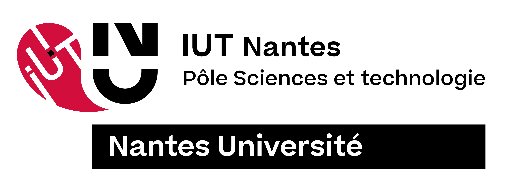
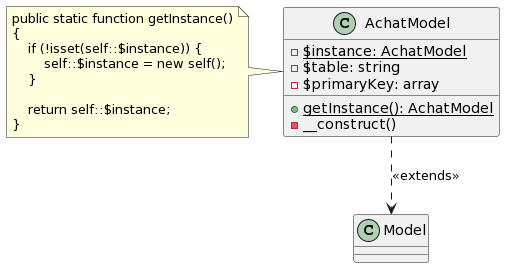
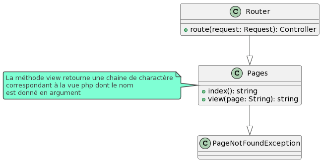
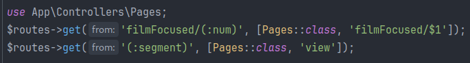
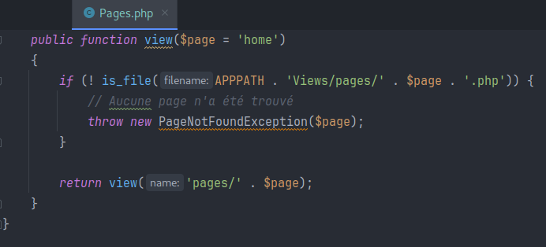

Bernier Justine	Pasquet Clément

Troeira Paul-Adrien	Malki Basma

Groupe 1-2



# SAE 3.01 : Qualité de Développement

-   **Consignes**
-   **Patron 1 : Singleton**
    -   A quel problème répond le design pattern choisi ?
    - Mise en oeuvre au niveau de conception détaillée UML.
    - Développement en PHP :
-   **Patron 2 : Stratégie**
    -   A quel problème répond le design pattern choisi ?
    - Mise en oeuvre au niveau de conception détaillée UML.
    - Développement en PHP :
-   **Patron 3 : Front Controller**
    -   A quel problème répond le design pattern choisi ?
    - Mise en oeuvre au niveau de conception détaillée UML.
    - Développement en PHP :
-   **Conclusion**


# **Consignes** : R3.04 | Qualité de développement

Dans le cadre du projet, on tâchera d’identifier et/de mettre en oeuvre différents patrons de
conception, en justifiant ses choix de conception. 

On utilisera un dépôt git partagé pour le code
du projet au sein de l’équipe de développement et pour fournir des livrables au client.

# Patron 1 : Singleton

## A quel(s) problème(s) répond le design pattern choisi ?

Chaque table possède son <u>propre modèle</u> qui permet d’y interagir. 

Cela permet de grouper les fonctions la concernant et d’éviter la redondance.

Cependant, nous pouvons créer *autant d'instances* que nous voulons, et c’est un problème. 

En garantissant qu'il n'y a qu'une seule instance de la classe, on peut aider à éviter les problèmes liés à l'accès concurrentiel et à la gestion de ressources partagées.

De même, l’utilisation du singleton permet **d’optimiser son système**. 

Ainsi, une seule instance de la classe est créée et réutilisée tout au long du cycle de vie de l'application. 

Cela peut économiser des ressources système, car la création d'instances multiples est évitée.

En évitant la création de ces instances, le Singleton peut réduire le temps nécessaire pour effectuer des opérations d'instanciation. 

## Mise en oeuvre au niveau de conception détaillée UML :



## Développement en php :

*Nous utilisons CodeIgniter 4*.

<br>

Avec notre framework, nous devons développer nos modèles de cette façon : 
```php
namespace App\Models;

use CodeIgniter\Model;

class achatModel extends Model
{
   protected $table = 'achat';
   protected $primaryKey = ['id_user', 'id_film'];

   public function setAchat($id_user, $id_film)
   {
       $data = [
           'id_user' => $id_user,
           'id_film' => $id_film,
       ];

       return $this->insert($data);
   }


   public function getFilmIdsByUserId($id_user)
   {
       $query = "CALL getFilmIdsByUserId(?)";
       $result = $this->db->query($query, [$id_user]);

       return $result->getResultArray();
   }

}

```
*( /app/Views/pages/yourMovies.php )*

Notre classe hérite d’une classe CodeIgniter, et nous n’avons qu’à instancier <u>$table</u> et <u>$primaryKey</u> pour pouvoir l’utiliser.

Dans le cas d’un singleton, il faut déjà initialiser une variable de classe : 
```php
private static $instance;
```

<br>

Que l'on validera dans la fonction d'instanciation : 
```php
// Méthode pour obtenir une instance unique du modèle
public static function getInstance()
{
   if (!isset(self::$instance)) {
       self::$instance = new self();
   }

   return self::$instance;
}
```

<br>

Nous mettons aussi le constructeur privé pour nous assurer d’être obligé de passer par la fonction <u>getInstance()</u> pour pouvoir utiliser notre singleton : 
```php
// Restreint la création d'objets en dehors de la classe
private function __construct()
{
   parent::__construct();
}
```

Comment l’utiliser ?

Pour l’utiliser, nous devrons forcément utiliser <u>getInstance()</u> comme ici : 
```php
public function getFilmByuser_id()
{

   ... 

   // Obtenir une instance unique du modèle AchatModel 
   $achatModel = achatModel::getInstance();
   $filmIds = $achatModel->getFilmIdsByUserId($id_user);

   ...

}
```

<br>
<br>

# Patron 2 : Stratégie

## A quel(s) problème(s) répond le design pattern choisi ?

Dans notre vue **filmFocused**, celle qui se charge d’afficher les films en grand, les liker ou les acheter, nous devons avoir un bouton d’achat.

Si l’utilisateur n’est pas connecté, le bouton redirige vers la <u>page de connexion</u>, 

si l’utilisateur est connecté, et qu’il n’a pas déjà acheté le film, on envoie en post les <u>valeurs de $film et de $user</u> ( chaque page filmFocused représentant un film unique, dont les valeurs sont dans la variable $film ).

Si l'utilisateur est connecté, et qu’il possède déjà le film, le bouton ne doit <u>pas s’afficher</u>.

Le problème de cela, c’est que notre vue possède une quantité importante de php, et que pour modifier le fonctionnement de notre php, il faut modifier la vue, ce qui ne respecte pas la séparation voulue par le MVC.

Pour éviter cela, nous allons, dans le contrôleur qui gère l’accès à la vue filmFocused, utiliser ***trois stratégies***, toutes trois qui héritent d’une interface <u>ButtonDisplayStrategy</u>, et qui chacunes possèdent leur propre méthode, pour afficher un bouton, ou ne pas en afficher un.

## Mise en oeuvre au niveau de conception détaillée UML :


## Développement en php :
*Nous allons mettre les stratégies dans un nouveau dossier /app/Controllers/DisplayStrategies.*

Le contrôleur gérant l’affichage de la page, <u>$pages</u>, se chargera d’utiliser l’une ou l’autre des stratégies en fonction de si l’utilisateur est connecté et possède le film ou non. 

Dans la vue, nous utiliserons la méthode ```displayButton``` de notre stratégie pour afficher ou non le bouton.


Code de la méthode du contrôleur <u>$pages</u> :
```php
public function filmFocused($id)
{
   $session = session();
   $filmOwned = false;

   // Si l'utilisateur est connecté
   if ($session->has('user') && $session->get('user') !== null) {
       $id_user = $session->get('user')['id_user'];
       $filmOwned = $this->achatModel->utilisateurPossedeFilm($id_user, $id);

       // Si l'utilisateur possède le film, on affiche rien
       if ($filmOwned) {
           $strategy = new AlreadyBuyedDisplaystrategy();
       } else { 
// Sinon, on affiche le bouton qui permet d'acheter le film
           $strategy = new ConnectedUserDisplayStrategy();
       }

   } else {
// Sinon, on affiche le bouton qui redirige vers la connexion
       $strategy = new GuestUserDisplayStrategy();
   }

   ...

   return view('filmFocused', [

       ...

       'filmOwned' => $filmOwned
   ]);
}
```

<br>

Nous allons créer une interface ```ButtonDisplayStrategy``` avec une seule fonction ```displayButton``` . 

Les trois stratégies implémentent cette classe :
```php
namespace App\Controllers\DisplayStrategies;

interface ButtonDisplayStrategy
{
   public function displayButton($film, $user);
}
```

<br>

**Première stratégie** : Si l’utilisateur n’est pas connecté, le bouton redirige vers la page de connexion.
```php
namespace App\Controllers\DisplayStrategies;

class GuestUserDisplayStrategy implements ButtonDisplayStrategy
{
   public function displayButton($film = null, $user = null)
   {
       echo '<a href="' . base_url('accountConnection') . '">'.
        '<button class="updateButton">'.
        '<p class="nunito updateButtonText">Acheter</p>'.
        '</button>'.
        '</a>';
   }
}
```

**Deuxième stratégie** : Si l’utilisateur est connecté, et qu’il ne possède pas le film, nous envoie les valeurs de film et user en post. 

```php
namespace App\Controllers\DisplayStrategies;

class ConnectedUserDisplayStrategy implements ButtonDisplayStrategy
{
   public function displayButton($film, $user)
   {

       $html = '<form action="' . base_url('payement') . '" method="post">';

       $html .= '<input type="hidden" name="id_film" value="' . $film['id_film'] . '">';
       … envoie des différentes valeurs de film

       $html .= '<input type="hidden" name="id_user" value="' . $user['id_user'] . '">';

       Affichage du bouton
       $html .= '<button type="submit" class="updateButton">';
       $html .= '<p class="nunito updateButtonText">Acheter</p>';
       $html .= '</button>';
       $html .= '</form>';

       return $html;
   }
}
```

<br>

**Troisième stratégie** : Si l’utilisateur est connecté, mais qu’il possède déjà le film, l’affichage d’un bouton “Acheter” n’a pas lieu d’être, la fonction ne renvoie donc rien.
```php
namespace App\Controllers\DisplayStrategies;

class AlreadyBuyedDisplaystrategy implements ButtonDisplayStrategy
{
   public function displayButton($film = null, $user = null)
   {

   }
}
```

<br>

Dans notre vue, il suffira d'appeler la fonction ```displayButton``` de notre stratégie : 
```php
<?= $buttonDisplayStrategy->displayButton($film, $user) ?>
```
*( $film et $user sont utilisés pour afficher la page de paiement )*

# Patron 3 : Front Controller 

## A quel(s) problème(s) répond le design pattern choisi ?

Le design pattern Front Controller répond au besoin de centraliser la gestion des requêtes entrantes dans une application web. 

Il offre un point d'entrée unique pour toutes les requêtes, permettant une gestion centralisée du routage. Cela simplifie la structure de l'application, améliore la maintenabilité et facilite l'ajout de fonctionnalités globales.

Dans notre projet, il permet aux pages statiques comprises dans le dossier “Views/pages” d’être prises en charge par la même route au niveau du controlleur Pages.

## Mise en oeuvre au niveau de conception UML :


## Développement en PHP



Dans Routes nous récupérons toutes les routes non gérées, qu’on redirige vers le controller ```Page```.

<br>



*( Dans le controller Pages )*

On récupère l'arborescence du fichier demandé en argument, puis on vérifie s'il existe dans ```Views/pages/``` pour retourner la vue correspondante.

# Conclusion


Nous avons vu 3 patterns de conception, dont 1 que nous ne connaissions pas.

Notre <u>**Singleton</u>** permet d’éviter les accès concurrentiels.

Notre <u>**Stratégie</u>** permet de mieux respecter la stricte séparation des modèles/vues/controleurs et de mieux “ranger” son code.

Notre <u>**Front Controller</u>** permet quant à lui de diminuer le nombre de routes à définir manuellement, tout en permettant de gérer l’accès à ces mêmes vues, comme pour notre page filmFocused.

Ces 3 designs patterns que nous avons utilisés pendant notre projet nous permettent de répondre aux différents problèmes que nous avons rencontrés dans notre projet, de la manière la plus optimale.
