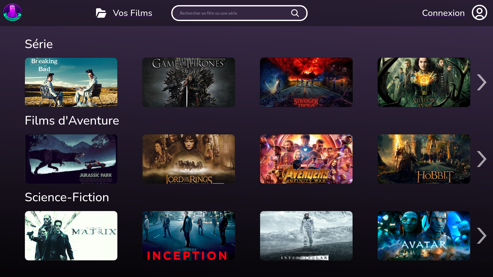
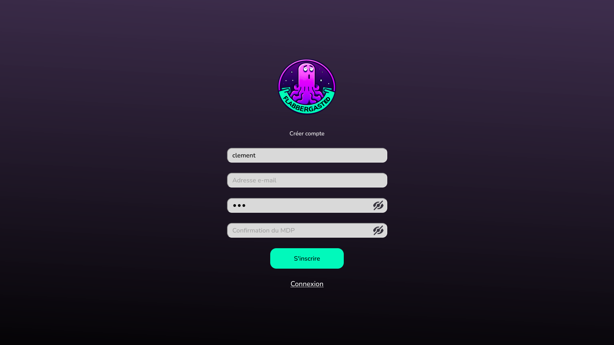
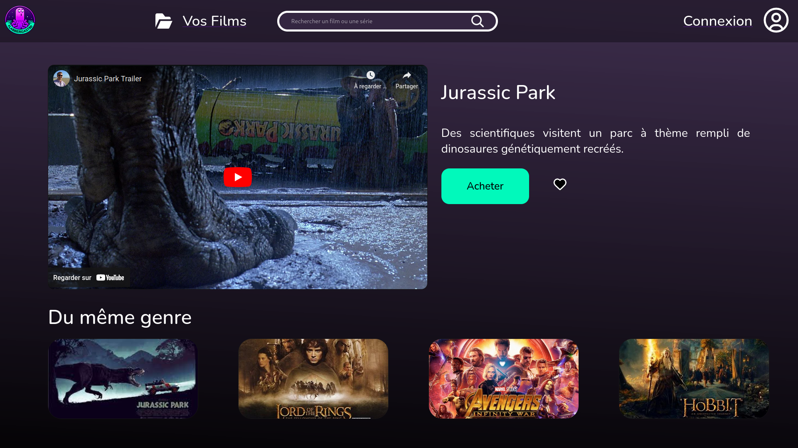
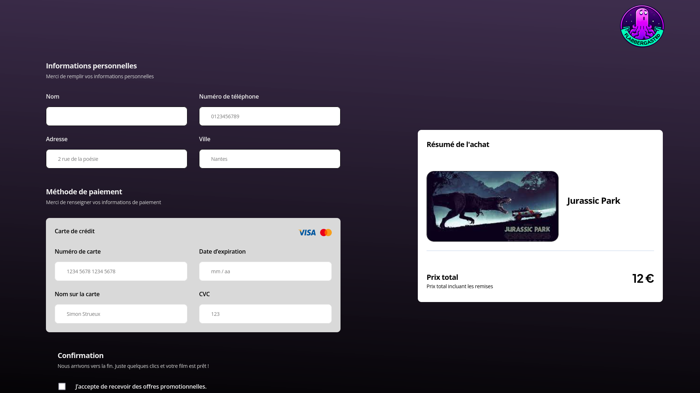
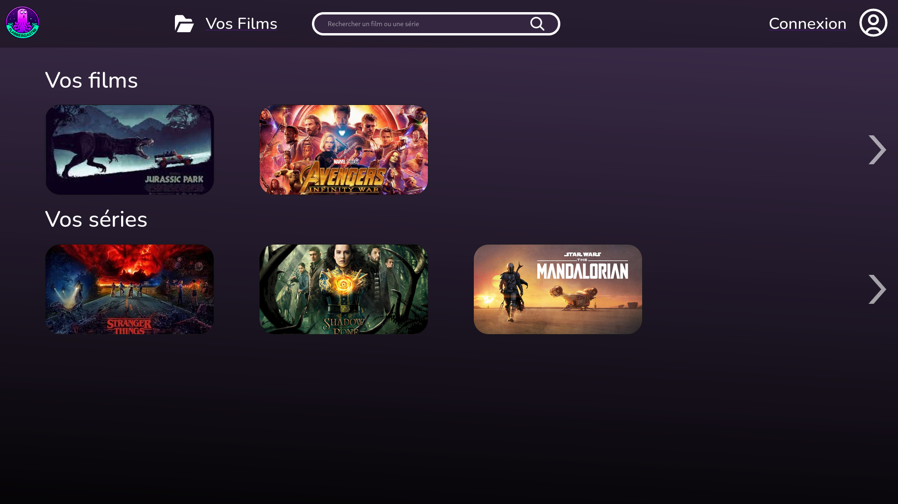

# Projet Flabbergasted



## But :
Créer un site web fonctionnel **de commerce**.

Dans notre cas, nous sommes partis sur un site web de film/série à l'unité.

Le système de vente est basé sur celui de YouTube, il n'existe pas de panier
et il n'est possible de n'acheter les films que un-par-un.

L'utilisateur pourra "liker" un film pour augmenter ses chances d'apparaître
avec la barre de recherche, et quand l'utilisateur aura acheté un film,
il pourra le retrouver dans la page "vosFilms" ( yourMovies ).

## Consignes :
Vous disposez d'une VM avec apache2, php 8.2,  mariaDB 10.1

La VM dispose de trois comptes root, user et sql, root et user disposent d'un accès en ssh et sql uniquement en sftp

Le SGBD dispose du compte user avec comme mot de passe pass et du compte sql avec comme mot de passe sql

Sur l'OS root et user ont le même mot de passe (ip, password) : 172.26.82.53
e3qnBIJF

## Utiliser le site web

En premier il faut se créer un compte cliquant sur "connexion" puis "Créer compte" :



( n'oublie pas de vous connecter après avoir crée votre compte )

Une fois sur l'accueil, vous pouvez cliquer sur n'importe quel film pour arriver sur la vue filmFocused.

Elle vous permet d'acheter ou de "liker" n'importe quel film.



Si vous décidez de cliquer sur acheter



( Le formulaire n'est pas utilisable pour l'instant, 
il ne récupère donc aucune donnée. 
Cliquer sur le bouton acheter rajoute instantanément le film à l'utilisateur sans conséquence.)

Vos films sont accessibles dans la rubrique "Vos Films" :



## Structure du code

La structure est classique des projets codeigniter, et est une structure sous forme
Modèles-Vues-Controleurs (MVC) :

- app
    - Config
        - Database.php
        - Routes.php
    - Controllers
        - Achat.php
        - Film.php
        - Likes.php
        - Pages.php
        - Utilisateur.php
    - Database
        - import
            - film.csv
        - mainDatabase_create.sql
        - mainDatabaseDump.sql
        - mainDatabase_populate.sql
        - stored_procedure.sql
    - Models
        - achatModel.php
        - filmModel.php
        - LikesModel.php
        - UserModel.php
    - Views
        - pages
            - yourMovies.php
- public
    - assets
        - css
            - yourMovies.css
        - images
            - logo1.png
- README.md


### "Config" contient les paramètres du projet.

- **Database.php** = gère la connexion à la BD.
- **Routes.php** = rajoute les "Routes" nécessaire aux fonctionnement de notre projet.

### "Controllers" contient les controleurs, un par table.
- **Achat.php**
- **Film.php**
- **Likes.php**
- **Pages.php** = Sert à accéder à toutes les vues contenues dans le dossier Pages par leur nom.
- **Utilisateur.php**

### "Database" gère la création et le remplissage de la BD.

- **import**
    - **film.csv** = Fichier contenant les films et séries utilisées pour remplir la bd
- **mainDatabase_create.sql** = Fichier de création des tables ( déprécié, il faut utiliser le dump ) 
- **mainDatabaseDump.sql** = Fichier de sauvegarde complet de la BD. A utiliser.
- **mainDatabase_populate.sql** = Fichier d'insertion des lignes dans la bd.  ( déprécié, il faut utiliser le dump ) 
- **stored_procedure.sql** = Fichier d'insertion des procédures stockées dans la bd. ( déprécié, il faut utiliser le dump ) 

### "Models" gère les modèles, utilisés pour modifier les tables de la bd.
Un modèle par table.
- Models
    - **achatModel.php**
    - **filmModel.php**
    - **LikesModel.php**
    - **UserModel.php**
### "Views" contient toutes les vues.
- Views
    - pages = Les vues dans ce dossier sont accessible directement en faisant /nom_de_la_vue grâce au controleur page.
        - **yourMovies.php**

### Tous les fichiers "accessibles au public" sont dans "public"
- public
    - assets
        - css = Contient les css de toutes les vues
            - **yourMovies.css**
        - images = Contient les images de tout le projet
            - **logo1.png**


## Utiliser la base de données
### Créer la BD sur son PC et la remplir
La base de données est actuellement faite pour fonctionner sur le même PC que le PHP.

Pour faire cela il faut :
- Avoir MariaDB ( ou MySQL )
- Utiliser le "dump" pour la remplir


```bash
sudo mysql -u admin -ppassword 
``` 
( pour se connecter en tant que admin, si un mdp est demandé, donner "password", le root ne possède pas de password )


```shell
sudo mysql -u root -p mainDatabase < mainDatabaseDump.sql
``` 
( pour utiliser le "dump" pour remplir la BD. **ATTENTION**, il faut être dans le dossier app/Database )

### Créer un dump

Si l'on souhaite faire une "sauvegarde" des diverses modifications faites aux tables et à leurs éléments, ils faut faire un dump, une "sauvegarde" :

```shell
mysqldump -u admin -ppassword --databases mainDatabase --routines --result-file=mainDatabaseDump.sql
```
( **ATTENTION**, il faut être dans le dossier app/Database )

( Le dump inclue désormais les procédures stockées )

## Rajouter une page

Pour rajouter une page il suffit de rajouter un fichier "**nom_de_page.php**" dans 
- app
  - Views
    - pages
      - **nom_de_page.php**"

La page sera accessible en faisant ```localhost:8000/nom_de_page```.

Le css devra être mis dans
- public
  - assets
    - css
      - **nom_de_page.css**

**ATTENTION**, n'oubliez d'adapter le chemin à votre css en utilisant ```<?=CSS.'nom_de_page.css'?>```.

CSS est un chemin php prédéfini vers le dossier css.

De même, pour les images, il faut utiliser ```<?=IMG.'logo1.png'?>```.

Il permet d'utiliser les images du répertoire image.